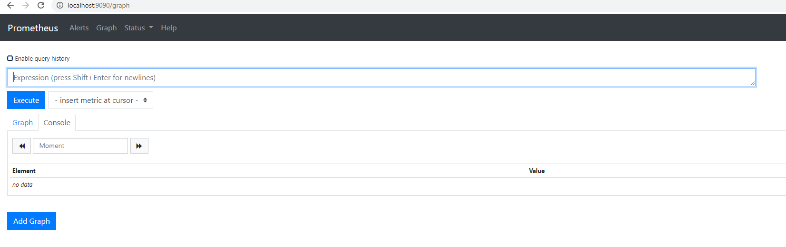
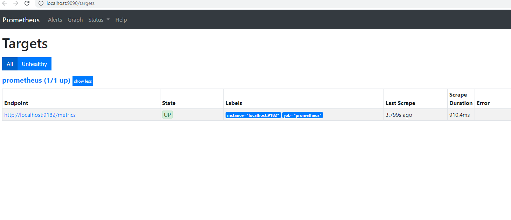
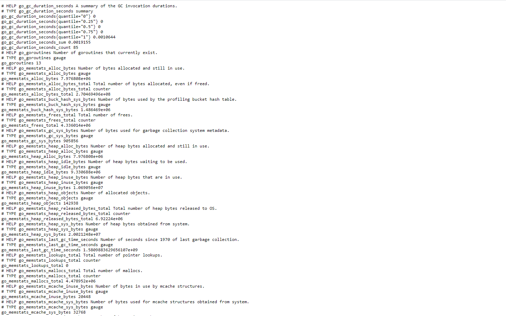
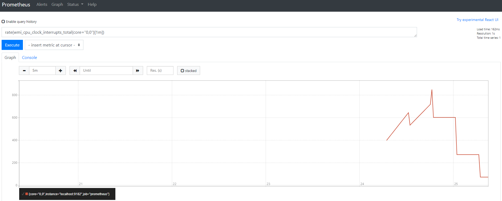
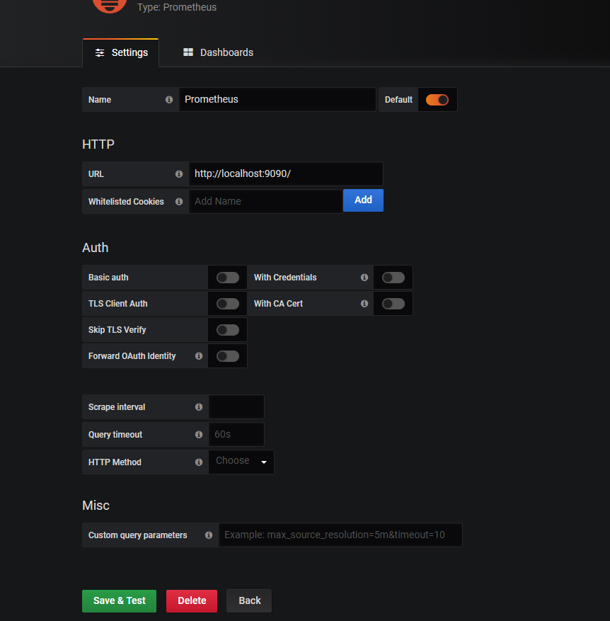
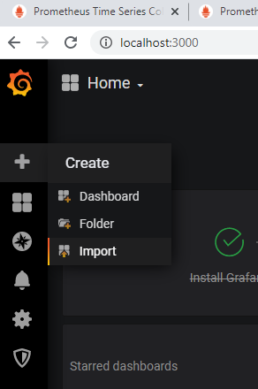
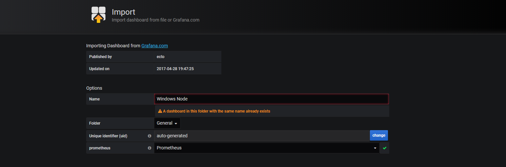
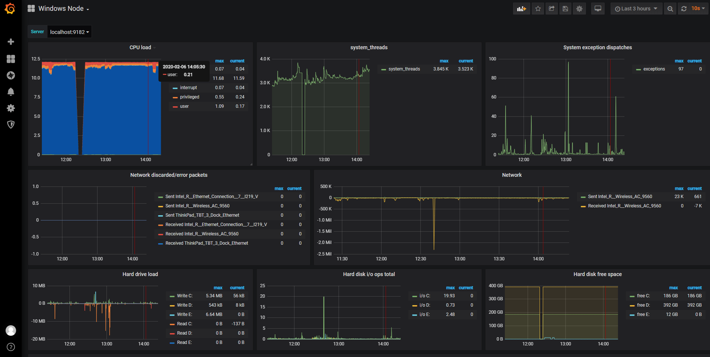

# Monitoring with Prometheus & Grafana
This gives an idea about installing prometheus and monitoring with Grafana in windows as a standalone system.
Prometheus is a pull based monitoring system, which pulls the monitoring statistics from the agent exporters and saves it in it's timeseries database. 
Prometheus comes with a simple graph ui for simple graph visualiyation. However, to visualize the metrics in a dashboard, Grafana can be used.

Here 2 components are used to monitor the windows node metrics </br>
    a. Prometheus </br>
    b. windows node exporter </br>
    c. grafana </br>

The prometheus and windows node exporter is covered in the prometheus section.

## Prometheus 
- The setup consists of prometheus server and the windows node exporter in a single host.

### versions
 - [Prometheus](https://prometheus.io/download/) version: 2.15.2.(choose the operating system and architecture from the drop down.)
 - Windows 10
 - [Windows Node exporter](https://github.com/martinlindhe/wmi_exporter/releases) version: 0.9.0-amd64 

### steps
 - Download the prometheus tar.gz file 
 - Unzip the tar.gz file
 - Download the Windows Node exporter (wmi) msi file.
 - start the wmi execuatable.
 - by default it start the exporter in 9182 port.
 - In the prometheus folder, open the prometheus.yml, change the target port to 9182. so that the prometheus can pull the metrics from the  wmi agent.
  
  ```
    scrape_configs:
      # The job name is added as a label `job=<job_name>` to any timeseries scraped from this config.
      - job_name: 'prometheus'
        static_configs:
        - targets: ['localhost:9182']
 ```
 - start the promehteus by executing the prometheus.exe 
 
 ### Testing the setup
 - By default, prometheus server can be accessed using 9090 port.
 - If the setup is correct, then prometheus can be accessed via http://localhost:9090/graph url. This should show like the below image
 
 
 - to check exporter agents, Go to the status->targets
  
 
 - click on the endpoint of the target, it will redirect you to a page looks like below image. This displays all the metrics from the window machine (my machine as i have installed in the sigle host).
   
   
 - A simple graph can be created out of a metrics with promethues.
  
  
## Grafana 
This is a tool for visualize data from various datasources.

### version
- [Grafana](https://grafana.com/grafana/download?platform=windows) version: 6.6.1 
 
### steps
- download the .msi installer and execute the  execuatable.
- By default, the port is 3000. To configure, download the windows binaries and configure the port.

#### integrating grafana with prometheus 
- To access the grafana, http://localhost:3000/
- default username#password is admin#admin
- add data source as prometheus. Give the prometheus endpoint in the URL section. The setting looks like below image.


- You can customize the dashboard. 
- However, there is an existing dashboard available for windows node that can be find [here](https://grafana.com/grafana/dashboards/2129).
- To import the existing dashboard, click "+" sign in the left side panel and click import.


- write the number 2129 and configure the settings as shown in the image and click import.


- Then go the home and click Windows Node. The dashboard will look like the below image.

